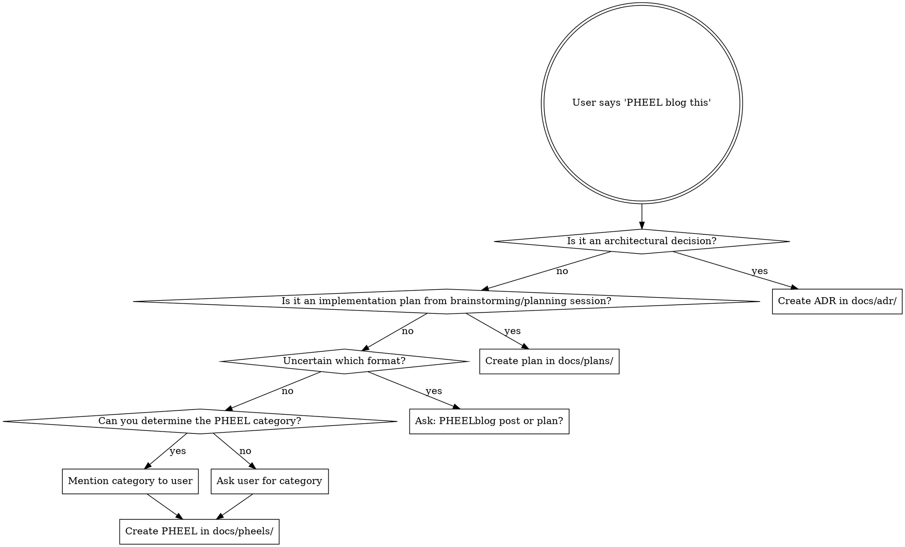

# PHEELblogging

## Overview

PHEELblogging creates a canonical, chronological, narrative record of project work by categorizing all work products into five types: Plans, Hypotheses, Explorations, Experiments, and Learnings. Each entry is a Jekyll-formatted blog post that serves as the single source of truth.

## When to Use

Trigger this skill when the user says:
- "PHEEL blog this"
- "field blog this" (speech-to-text often renders it this way)
- "Let's pheelblog this"

**Decision flowchart for choosing the right location:**



## PHEEL Categories

| Category | When to Use | Example Triggers |
|----------|-------------|------------------|
| **plan** | Decision about what to do next, with finishing condition and time-box | "Here's our roadmap", "Let's tackle this in three phases" |
| **hypothesis** | Assumption being tested, often in Lean Hypothesis format | "I think users want X", "This should improve Y metric" |
| **exploration** | Research, investigations, comparative analysis, informal findings | "I looked into how competitors handle this", "Survey of approaches" |
| **experiment** | Formal tests, prototypes, user testing, interventions | "We tested the new flow with 10 users", "Prototype results" |
| **learning** | Insights, retrospectives, valuable failures, "never do that again" moments | "We discovered X doesn't work", "Key insight from sprint" |

## Implementation Steps

1. **Determine the destination**:
   - ADRs → `docs/adr/` (follow ADR conventions: NNN-title.md)
   - Implementation plans → `docs/plans/` (YYYY-MM-DD-title.md)
   - PHEELs → `docs/pheels/` (YYYY-MM-DD-title.md)

2. **Assert or ask for category**:
   - If clear: Mention it to user: "Creating a pheelblog in the experiment category"
   - If uncertain: Ask user which category

3. **Generate filename**:
   - Format: `YYYY-MM-DD-short-description.md`
   - Use today's date
   - Create slug from title (lowercase, hyphens, no special chars)

4. **Create frontmatter** (see structure below)

5. **Add content** from the conversation or context being pheelblogged

## Frontmatter Structure

```yaml
---
layout: post
title: "Human-Readable Title"
date: YYYY-MM-DD
category: plan | hypothesis | exploration | experiment | learning
tags: ["tag1", "tag2", "tag3"]
---
```

**Field requirements:**
- `layout`: Always `post`
- `title`: Clear, descriptive, human-readable (use quotes)
- `date`: ISO format (YYYY-MM-DD), use today's date
- `category`: MUST be one of the five PHEEL types (singular, lowercase)
- `tags`: Array of relevant topics or modalities

**Tag suggestions:**
- Topics: "authentication", "front-end", "performance", "recommendations"
- Modalities: "user-test-data", "benchmarks", "prototype", "competitive-analysis"
- Timeframes: "Q1", "sprint-3", "MVP"

## Example

After a user testing session, user says "Let's pheelblog this":

```markdown
---
layout: post
title: "Users Prefer Visual Progress Indicators Over Percentage Text"
date: 2026-02-23
category: learning
tags: ["user-testing", "UI", "onboarding"]
---

# Users Prefer Visual Progress Indicators Over Percentage Text

During our onboarding flow user testing session (Feb 23, 2026), we tested two variants...

[Content continues...]
```

Filename: `docs/pheels/2026-02-23-users-prefer-visual-progress-indicators.md`

## Common Mistakes

| Mistake | Fix |
|---------|-----|
| Using plural category (`plans` instead of `plan`) | Use singular: `plan`, `hypothesis`, `exploration`, `experiment`, `learning` |
| Forgetting to ask when uncertain | If you can't determine plan vs pheel vs ADR, ask explicitly |
| Missing tags | Always include at least 1-2 relevant tags |
| Using bold for headings | Use markdown headings (##, ###), not **bold** |
| Wrong directory | Plans from brainstorming → `docs/plans/`, not `docs/pheels/` |

## Validation Checklist

Before creating a PHEELblog entry, verify:

- [ ] Frontmatter present and valid YAML
- [ ] `title` specified (quoted string)
- [ ] `date` in ISO format (YYYY-MM-DD)
- [ ] `category` is one of: plan, hypothesis, exploration, experiment, learning (singular)
- [ ] `tags` array with at least one tag
- [ ] File in correct directory (docs/pheels/, docs/plans/, or docs/adr/)
- [ ] Filename follows convention (YYYY-MM-DD-title.md or NNN-title.md for ADRs)
- [ ] Content uses markdown headings (##), not bold text

## Integration with Other Formats

**ADRs (Architecture Decision Records)**: Keep architectural decisions in `docs/adr/` following ADR conventions. ADRs use frontmatter for metadata but follow their own numbering system (NNN-title.md).

**Implementation Plans**: LLM-generated plans from brainstorming sessions go in `docs/plans/` using Jekyll naming (YYYY-MM-DD-title.md). These are often the output of planning/brainstorming sessions.

**PHEELs**: Everything else - hypotheses, learnings, experiments, explorations, and human-written plans go in `docs/pheels/`.

All three formats use Jekyll-compatible frontmatter and can be compiled into a unified blog when needed.
